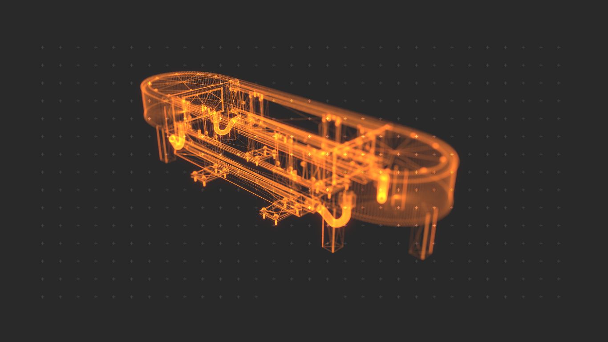
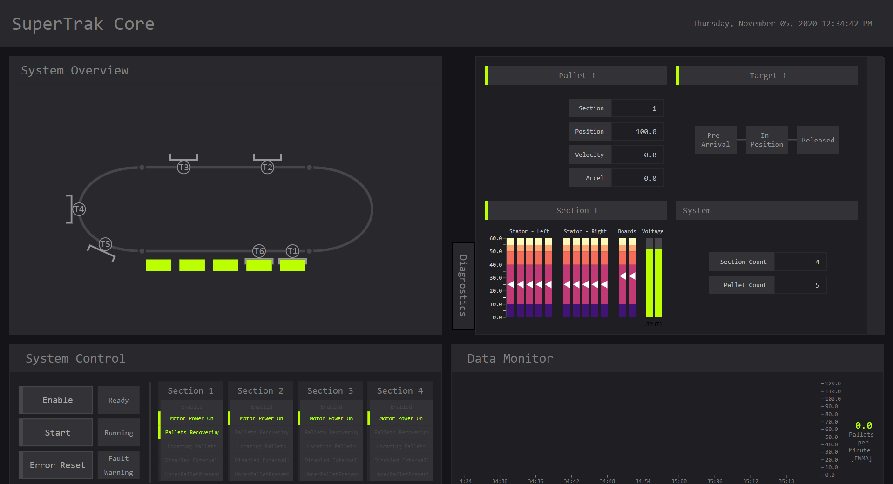

## SuperTrak Core

ST_Core is a lightweight Starter Project designed to simplify & accelerate the startup process of SuperTrak linear transport systems.



---

### Features:

 * Prebuilt main state machine w/ shuttle recovery
 * Simple-to-use data structure for commanding Pallets & Targets
 * Intuitive mappView Developer Console for rapid testing
 * Ready-to-go Configurations for Simulated or Physical systems
 * All necessary documentation for SuperTrak software setup

#### Data Structure:

A basic data structure **gSuperTrak** is provided to the user with commands and system information. This structure can be used to create quick routing instructions from station Targets.

Here's what that looks like:

```pascal
IF gSuperTrak.Status.Target[1].PalletPresent THEN 	// If a pallet arrives at Target 1...

	targetTimer[1].IN		:= TRUE;				// Then start a timer...

	IF targetTimer[1].Q THEN						// When that timer completes...
		gSuperTrak.Par.Target[1].Config.Acceleration		:= systemAccel;
		gSuperTrak.Par.Target[1].Config.Velocity			:= systemVelo;
		gSuperTrak.Par.Target[1].Config.DestinationTarget	:= 2;
		gSuperTrak.Par.Target[1].Config.Direction			:= stCOM_DIR_RIGHT;
													// Set motion parameters and release the shuttle
		gSuperTrak.Par.Target[1].ReleaseToTarget			:= TRUE;
	END_IF;			
ELSE
	gSuperTrak.Par.Target[1].ReleaseToTarget				:= FALSE;
END_IF;
```

#### mappView Developer Console:

Rapidly test project code with a simple interface, including a live animated widget of the track system that automatically scales to your track topology.



### Prerequisites

 - Automation Studio >= 4.7.4.67 SP
 - TrackMaster configuration GUI
 - B&R SceneViewer

### Getting Started

An example walkthrough presentation is provided in the project directory at *SuperTrak_Core/Logical/Documentation/*

Further documentation can be found in the **libStCom.chm** Help File (included), the **LibSuperTrak.chm** Help File (included), or the TrackMaster Help File.
